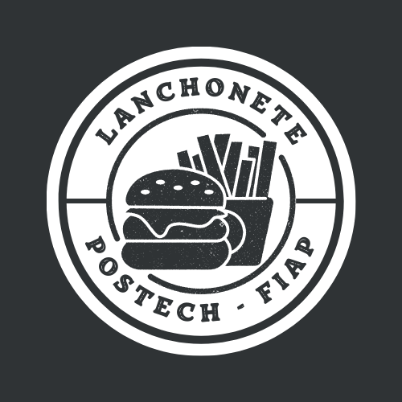

# PosTech - Lanchonete



O projeto Lanchonete do Bairro tem como objetivo desenvolver um sistema de gerenciamento para uma lanchonete familiar. O sistema será desenvolvido utilizando a arquitetura limpa e seguirá os princípios do *Domain-Driven Design* (DDD).

Através desse sistema, os clientes terão acesso a uma interface intuitiva onde poderão realizar pedidos e efetuar pagamentos de forma prática. Será possível montar o combo de lanches com opções de lanche, acompanhamento e bebida. O sistema também permitirá que os clientes acompanhem o progresso do seu pedido, desde a confirmação até a entrega ou retirada.

Além das funcionalidades voltadas para os clientes, o sistema contará com um painel administrativo que permitirá o gerenciamento de clientes, produtos e categorias. O estabelecimento poderá cadastrar novos clientes, gerenciar campanhas promocionais, adicionar, editar e remover produtos, definindo nome, categoria, preço, descrição e imagens. Também será possível acompanhar os pedidos em andamento e verificar o tempo de espera de cada pedido.

O projeto será desenvolvido utilizando a linguagem de programação Java 17 e o framework Spring Boot. Será integrado ao banco de dados MariaDB para armazenar as informações dos clientes, produtos e pedidos. Além disso, o projeto incluirá a documentação do sistema utilizando a linguagem ubíqua (DDD) e a implementação de *endpoints* RESTful para as funcionalidades descritas.

Com o projeto Lanchonete do Bairro, pretendemos criar um sistema eficiente e intuitivo que facilite o processo de pedido e pagamento, proporcionando uma experiência agradável aos clientes e auxiliando o estabelecimento.

## Linguagem Ubíqua

1. Lanchonete: Estabelecimento que oferece uma variedade de alimentos e bebidas.
2. Cliente: Pessoa que faz um pedido na lanchonete.
3. Pedido: Solicitação de alimentos e/ou bebidas feita por um cliente.
4. Produto: Produtos que compõem um pedido
5. Acompanhamento: Opção adicional selecionada pelo cliente para acompanhar seu lanche.
6. Lanche: Alimento principal do pedido, como hamburguês, pizza, etc.
7. Acompanhamento: Alimento secundário do pedido, como batata frita, salada, etc.
8. Bebida: Opção de bebida selecionada pelo cliente.
9. Sobremesa: Complemento da alimentação.
10. Pagamento: Processo de efetuar o pagamento do pedido.
11. Sistema de Pedido: Tela ou dispositivo no estabelecimento que mostra o status do pedido em diferentes etapas para os clientes e para a equipe da cozinha.
12. Equipe da cozinha: Funcionários responsáveis por preparar os pedidos.
13. Status do Pedido: Indicador do progresso do pedido, dividido em:
14. Recebido: Pedido registrado e aguardando preparação.
15. Em preparação: Pedido em processo de preparação na cozinha.
16. Pronto: Pedido concluído e pronto para retirada.
17. Finalizado: Pedido entregue e finalizado.
18. Entrega: Processo de notificar o cliente quando o pedido está pronto para retirada.
19. Acompanhamento de Pedidos: Funcionalidade que permite acompanhar o status dos pedidos em andamento e estimar o tempo de espera.
20. Balcão de recolha: Local físico onde os pedidos são entregas quando finalizado para a recolha pelo cliente.

## Fluxo de Funcionalidades (Representação Pictográfica)

Alguns dos fluxos que este Sistema se propõe a resolver são os de realização do pedido e seu pagamento e a preparação e entrega do pedido. Os fluxos foram mapeados como são feitos hoje, sem a implementação do sistema, e como se visualiza após a sua implementação.

### Preparação e entrega do pedido


Fluxo 1. Fluxo antigo onde o pedido é recebido pela equipe de cozinha por uma anotação em papel e prepara todos os produtos, sem informar seu status a ninguém.

### Novo fluxo de preparação e entrega do pedido


Fluxo 2. Novo fluxo proposto onde a equipe de cozinha pode visualizar os pedidos em um sistema de pedidos e à medida que os produtos são feitos, seu status é alterado e o cliente pode acompanhar este status.

### Realização do pedido e seu pagamento


Fluxo 3. Fluxo antigo onde o cliente depende de um funcionário para realizar o pedido e pagamento. Além disso o pedido só é enviado para a equipe da cozinha por uma ação do funcionário.

### Novo fluxo de realização do pedido e seu pagamento


Fluxo 4. Fluxo atualizado com nova proposta. Cliente pode interagir diretamente com a interface de seleção de produtos e realizar ele mesmo o pagamento. Além disso, o pedido vai diretamente para o sistema de pedidos assim que o pagamento é realizado.

## Arquitetura limpa

A arquitetura limpa é um conceito de design de software que promove a separação de responsabilidades em camadas bem definidas. A arquitetura limpa visa manter a independência das camadas, facilitando a manutenção, teste e evolução do software. Ela foi utilizada neste projeto pois permite que este seja eveluido de forma mais simples futuramente.

A estrutura geral do projeto pode ser vista a seguir:

```sh
├── main
|  ├── java
|  |  └── br
|  |     └── com
|  |        └── lanchonetebairro
|  |           ├── applicationrules <- 2. Application Business Rules
|  |           |  ├── exceptions
|  |           |  └── usecases
|  |           |        ├── cliente
|  |           |        ├── pedido
|  |           |        └── produto
|  |           ├── enterpriserules <- 1. Enterprise Business Rules
|  |           |  ├── entities
|  |           |  └── enums
|  |           ├── frameworksdrivers <- 4. Frameworks & Drivers
|  |           |  ├── external
|  |           |  |  ├── notificacao
|  |           |  |  └── pagamento
|  |           |  └── web
|  |           └── interfaceadapters <- 3. Interface Adapters
|  |              ├── adapter
|  |              ├── controllers
|  |              ├── dto
|  |              ├── gateways
|  |              ├── handler
|  |              └── repositories
```

As camadas do projeto foram divididas seguindo a logica proposta pela arquitetura limpa, sendo 4 as prinipais assinaladas na árvore de estrutura acima.

1. **Enterprise Business Rules:** Esta camada contém regras de negócios de alto nível e princípios que são específicos para a organização ou domínio de negócios.
2. **Application Business Rules**: Aqui, você encontra as regras de negócios da aplicação, que são específicas para a aplicação em si, independentemente do domínio de negócios. É onde a lógica de negócios central é implementada.
3. **Interface Adapters**: Esta camada lida com a interação entre a aplicação e o mundo exterior. Inclui adaptadores para interfaces de usuário, bancos de dados, serviços externos e qualquer outra coisa que não seja parte da aplicação em si.
4. **Frameworks & Drivers**: É onde você integra frameworks, bibliotecas e drivers externos necessários para executar a aplicação. Isso inclui o banco de dados, frameworks web, ferramentas de comunicação e assim por diante. É a fronteira entre a aplicação e o ambiente externo.

## OpenAPI

O OpenAPI é uma especificação que define um padrão para descrever APIs RESTful de maneira padronizada, independente de linguagem e de plataforma. Com o OpenAPI é possível documentar de forma estruturada todos os *endpoints*, parâmetros, respostas e demais detalhes de uma API, facilitando a compreensão e a utilização por parte de desenvolvedores e consumidores. Já o Swagger é uma ferramenta que utiliza a especificação OpenAPI para gerar automaticamente a documentação interativa da API. Através do Swagger UI é possível acessar a documentação da API em um formato amigável, que permite explorar os *endpoints*, testar as requisições e visualizar as respostas esperadas. O uso do OpenAPI e do Swagger traz diversos benefícios, como a padronização da documentação, a facilidade de integração entre sistemas e a promoção de uma documentação atualizada e de qualidade. Para acessar a documentação gerada pelo Swagger, basta acessar a URL específica fornecida pelo projeto que é `/swagger-ui/index.html#/`

## Verificação de integridade (Health Check)

O Health Check é um mecanismo que permite verificar o estado de saúde de um sistema ou serviço em tempo real. É utilizado para monitorar e validar se o sistema está funcionando corretamente, fornecendo informações sobre sua disponibilidade e desempenho.

No contexto deste projeto, o Health Check foi implementado para garantir a integridade e a estabilidade do sistema, permitindo que os administradores ou ferramentas de monitoramento verifiquem a saúde da aplicação de forma automatizada. O projeto utiliza o Health Check para fornecer um endpoint específico, `/actuator/health`, que retorna informações sobre o estado do sistema, incluindo o status atual. Isso é útil para identificar problemas e tomar ações corretivas, garantindo a disponibilidade e a qualidade do serviço. Ao utilizar o Health Check, o projeto busca facilitar o monitoramento e o diagnóstico de problemas, contribuindo para uma melhor experiência do usuário e um ambiente mais confiável.

## Alguns endpoints úteis

```sh
/actuator/health: Informações de saúde da aplicação, incluindo o status do banco de dados.
```

```sh
/actuator/info: Informações gerais sobre a aplicação, incluindo informações sobre o banco de dados.
```

```sh
/actuator/metrics: Métricas da aplicação, como tempo de execução de consultas no banco de dados.
```

## Kubernetes

O Kubernetes foi escolhido como sistema de orquestração de contêineres por oferecer recursos avançados para gerenciar aplicativos em ambientes de produção. Com recursos como escalabilidade automática, implantação declarativa e tolerância a falhas, o Kubernetes simplifica e automatiza o gerenciamento de aplicativos em contêineres, permitindo alta disponibilidade e escalabilidade. Sua arquitetura modular e extensível, juntamente com a ativa comunidade de desenvolvedores, tornam o Kubernetes uma escolha confiável para empresas que buscam uma solução robusta e escalável para executar e gerenciar seus aplicativos em contêineres.


Figura 2 - Visão geral da arquitetura do Kubernetes

1. Requisição Externa: A requisição inicial é originada externamente e direcionada ao sistema.
2. Service "lanchonetebairro": Este serviço atua como ponto de entrada para a aplicação principal. O arquivo de configuração "**lanchonetebairro-svc.yaml**" define esse serviço, que desempenha um papel fundamental no roteamento da requisição para o destino adequado.
3. Deployment: Esta camada consiste nos pods que compõem a aplicação. O arquivo de configuração "**lanchonetebairro-deployment.yaml**" define como esses pods são criados e escalados.
4. HPA (Horizontal Pod Autoscaler): O arquivo de configuração "**lanchonetebairro-hpa.yaml**" define o HPA, que é responsável por ajustar automaticamente o número de réplicas dos pods com base na carga de trabalho, garantindo escalabilidade.
5. Pods: São as instâncias individuais da aplicação que foram criadas de acordo com as especificações definidas no *deployment*.
6. Service do banco de dados MariaDB: O arquivo "**db-svc.yaml**" configura o service que fornece uma interface para acessar o banco de dados MariaDB.
7. Pod do MariaDB: O arquivo "**db-pod.yaml**" define o pod responsável por executar o banco de dados MariaDB.
8. ConfigMap: O arquivo "**db.configmap.yaml**" define o ConfigMap, que é utilizado para armazenar e fornecer configurações para os componentes do sistema, como senhas e outras informações sensíveis.

Essas camadas e serviços trabalham juntos para garantir que a requisição seja encaminhada corretamente, que a aplicação esteja disponível, escalável e que haja uma conexão adequada com o banco de dados.